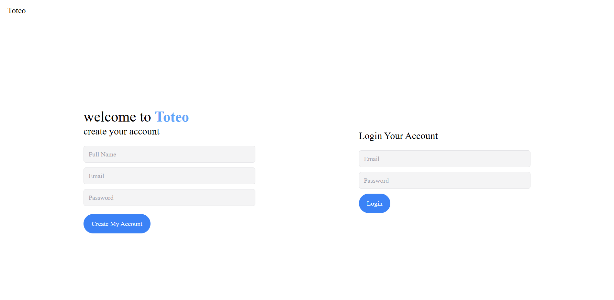
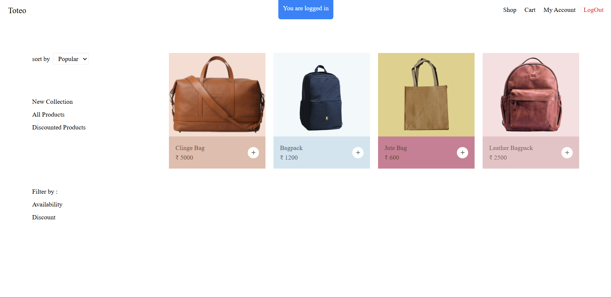
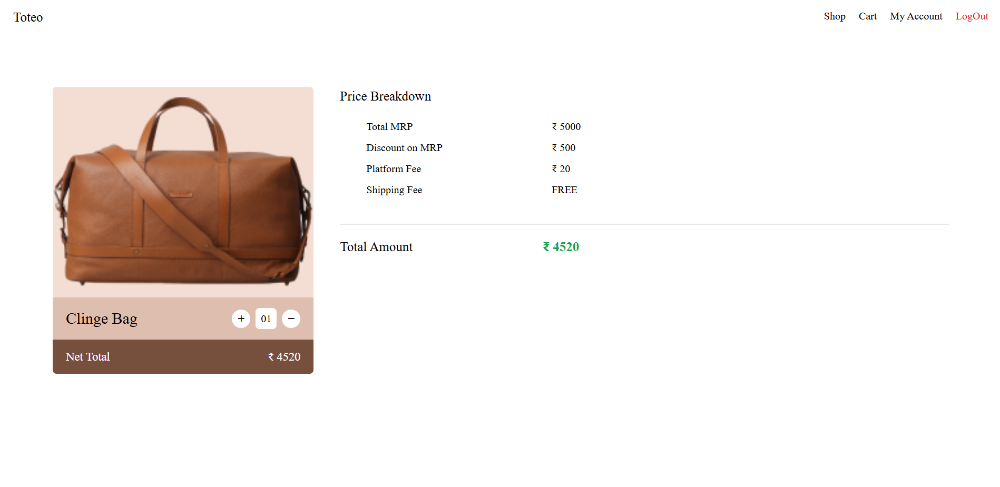

<h1 align="center">🛒 Toteo Ecommerce</h1>

  <b>A modern, full-stack Node.js & Express web app for online shopping</b> 
  Toteo features authentication, product management, cart system, admin controls, and a clean responsive UI built with EJS + Tailwind CSS.

  
  
  
  
  

---

## ✨ Features

- 👤 **User Authentication** (register, login, session handling)  
- 🛍️ **Product Management** (add, update, delete – admin only)  
- 🛒 **Cart System** (add, remove, checkout)  
- 💬 **Flash Messages** for feedback  
- 🔒 **Secure Sessions** with `express-session`  
- 🎨 **Responsive UI** with TailwindCSS  

---

## 📸 Screenshots

  
  
  
  

---

## 📂 Project Structure

- /routes -> Express route handlers
- /models -> Mongoose models
- /views -> EJS templates
- /public -> Static assets (CSS, JS, images)
- /controllers -> Business logic
---

## 🛠️ Tech Stack

- **Backend**: Node.js, Express.js  
- **Database**: MongoDB + Mongoose  
- **Frontend**: EJS, Tailwind CSS  
- **Middleware**: Multer (file uploads), express-session, connect-flash  

--- 
=======

 <i>Made with ❤️ by <a href="https://github.com/kartik-hub-enjay">Kartik Pareek</a></i> 

>>>>>>> 2178e55 (screenshots)
